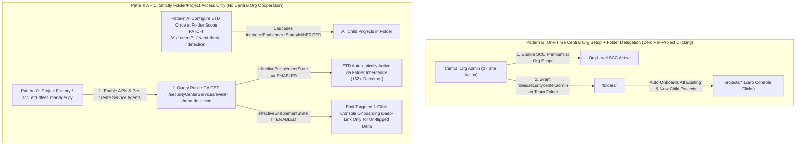

# SCC & Event Threat Detection (ETD) Technical Verification & Solutions Guide

This document records the live technical verification, API analysis, and production-ready external automation solutions for three key Security Command Center (SCC) and Event Threat Detection (ETD) operational questions.

---

## 📋 Issue & Question Log

| # | Category | Summary | Status | Verified External Solution |
| :--- | :--- | :--- | :--- | :--- |
| **Q1** | **Premium Activation** | Is activating project-level SCC Premium Console-only, or is a programmatic path (`gcloud` / API / Terraform) available or planned? | `VERIFIED & RESOLVED` | **Initial tier switch is currently Console-only**; programmatic **pre-flight API/identity setup** and **effective-state verification** (`GET /v1/{parent}/locations/global/securityCenterServices/event-threat-detection`) are **100% Public GA** (`scripts/scc_etd_fleet_manager.py`). Programmatic onboarding API is on the roadmap. |
| **Q2** | **ETD Enablement (Terraform)** | Is wrapping `gcloud scc manage services update event-threat-detection` in Terraform the recommended approach for enabling built-in ETD service/modules, or is a native Terraform resource on the roadmap? | `VERIFIED & RESOLVED` | Native TF resource for `SecurityCenterService` is tracked on the provider backlog (`<= v8.5.0` only covers custom modules). **Recommended today**: Reusable Terraform wrapper module (`terraform/modules/scc-etd-service`) calling the **Public GA Security Center Management API v1** (`PATCH .../securityCenterServices/event-threat-detection`) or `gcloud ... --quiet`. |
| **Q3** | **Per-Project Activation at Scale** | How do customers with only folder/project-level access (no org-level ownership) automate project-level SCC Premium activation at fleet scale? | `VERIFIED & RESOLVED` | **3-Part Fleet Pattern**: (1) **Folder-level ETD policy inheritance** (`folders/<FOLDER_ID>/.../event-threat-detection`), (2) **Delegated one-time Org activation with Folder-scoped IAM** (`roles/securitycenter.admin` on Folder), and (3) **Automated Fleet Pre-flight + Audit + 1-Click Onboarding Delta CLI** (`scripts/scc_etd_fleet_manager.py`). |

---

## 🔬 Question 1: Project-Level SCC Premium Activation (Tier Flip)

> **Question**: Is activating project-level SCC Premium Console-only? We couldn't find any `gcloud` / API / Terraform way to do the tier flip. Is a programmatic path available or planned?

### 1.1 Direct Answer & Architecture
**Yes — flipping a standalone project's SCC tier from Standard to Premium (or Enterprise) is currently restricted to the Google Cloud Console UI.**

When an administrator clicks **Activate** in the Google Cloud Console for a project, the Console UI executes three steps:
1. **Service Agent Provisioning**: Provisions the project-scoped SCC service identities (`service-project-<PROJECT_NUMBER>@security-center-api.iam.gserviceaccount.com` and `service-project-<PROJECT_NUMBER>@gcp-sa-ktd-hpsa.iam.gserviceaccount.com`).
2. **IAM Role Binding**: Binds `roles/securitycenter.serviceAgent` and `roles/containerthreatdetection.serviceAgent` on the project.
3. **Commercial Tier Activation**: Executes the internal tier-flip RPC after interactive billing acknowledgment. Because the tier-mutation RPC is restricted to the Google Cloud Console UI, calling it directly via external REST/CLI returns HTTP `404 Not Found` (`Method not visible to labels: {PUBLIC}`).

### 1.2 What IS Publicly Programmable Today + Roadmap
* **Roadmap**: A public asynchronous onboarding API in `securitycentermanagement.googleapis.com` is on the product roadmap to support programmatic tier activation.
* **Available Now (100% Public GA)**:
  1. **Programmatic API & Service Identity Pre-Provisioning**:
     ```bash
     gcloud services enable securitycenter.googleapis.com securitycentermanagement.googleapis.com --project=<PROJECT_ID>
     gcloud beta services identity create --service=securitycenter.googleapis.com --project=<PROJECT_ID>
     ```
  2. **Programmatic Tier Eligibility & Effective State Verification (`SecurityCenterService`)**:
     Per the official [Security Center Management API v1 specification](https://cloud.google.com/security-command-center/docs/reference/security-center-management/rest/v1/projects.locations.securityCenterServices), the `effectiveEnablementState` field of `securityCenterServices/event-threat-detection` reflects both ancestor inheritance and **billing tier eligibility / onboarding status**. Because Event Threat Detection is a Premium/Enterprise-only service:
     - `effectiveEnablementState: "DISABLED"` (when `intendedEnablementState` is `ENABLED` or `INHERITED`) indicates SCC Premium is **not** yet active on the project.
     - `effectiveEnablementState: "ENABLED"` confirms that SCC Premium/Enterprise is active and ETD is running.

---

## 🛠️ Question 2: Enabling Built-in ETD Service & Modules in Terraform

> **Question**: The Terraform `google` provider (checked up to `v8.5.0`) only has resources for ETD custom modules. There's nothing for enabling the built-in ETD service or modules. Is wrapping `gcloud scc manage services update event-threat-detection` (Security Center Management API) in Terraform the recommended approach for now, or is a native TF resource on the roadmap?

### 2.1 Direct Answer & Roadmap Status
* **Provider Roadmap**: Native Terraform resources for `SecurityCenterService` (`google_scc_management_organization_security_center_service` / `folder` / `project`) are tracked as an enhancement request on the `hashicorp/terraform-provider-google` backlog, and are **not yet implemented** up to `v8.5.0`.
* **Underlying API Status**: Unlike the tier flip in Q1, the **Security Center Management API v1 (`securityCenterServices/event-threat-detection`)** is **100% Public GA** for both reading (`GET`) and updating (`PATCH`) across **Organization, Folder, and Project** scopes.
* **Recommended Terraform Approach Today**: Wrapping the Security Center Management API v1 (or `gcloud scc manage services update event-threat-detection --quiet`) inside a reusable Terraform module paired with `data "http"` state readback is the recommended production pattern today.

### 2.2 Critical Operational Gotchas Discovered During Live Testing
1. **Interactive Prompt Hang in `gcloud`**:
   Running `gcloud scc manage services update event-threat-detection` without `--quiet` outputs an interactive confirmation prompt:
   ```text
   Are you sure you want to update the Security Center Service
   [projects/<PROJECT_ID>/locations/global/securityCenterServices/event-threat-detection]?
   Do you want to continue (Y/n)?
   ```
   **In Terraform `local-exec` or CI/CD runners, omitting `--quiet` causes `terraform apply` to hang indefinitely.** Always pass `--quiet` (or use direct REST `PATCH`).
2. **Partial Module Override Merge Behavior**:
   Passing `--module-config-file` or `PATCH ...?updateMask=intendedEnablementState,modules` with a subset of built-in modules (e.g. `PERSISTENCE_IAM_ANOMALOUS_GRANT`) **cleanly merges** your overrides on the server side without wiping the other ~170 built-in ETD detector modules.
3. **Dry-Run Validation Support (`?validateOnly=true` / `--validate-only`)**:
   Both the REST `PATCH` endpoint and `gcloud` CLI support dry-run validation without mutating state.

### 2.3 Live Verification Evidence (Sanitized)
```text
$ python3 scripts/scc_etd_fleet_manager.py configure-etd \
    --scope projects/<PROJECT_ID> \
    --state ENABLED \
    --enable-modules PERSISTENCE_IAM_ANOMALOUS_GRANT,MALWARE_BAD_DOMAIN

[
  {
    "parent": "projects/<PROJECT_ID>",
    "validateOnly": false,
    "name": "projects/<PROJECT_NUMBER>/locations/global/securityCenterServices/event-threat-detection",
    "intendedEnablementState": "ENABLED",
    "effectiveEnablementState": "ENABLED",
    "updatedModules": {
      "PERSISTENCE_IAM_ANOMALOUS_GRANT": {
        "intendedEnablementState": "ENABLED",
        "effectiveEnablementState": "ENABLED"
      },
      "MALWARE_BAD_DOMAIN": {
        "intendedEnablementState": "ENABLED",
        "effectiveEnablementState": "ENABLED"
      }
    }
  }
]
```

See [`terraform/modules/scc-etd-service`](../terraform/modules/scc-etd-service/README.md) for the complete Terraform module implementation supporting both `REST_API` and `GCLOUD_CLI` modes.

---

## 🌐 Question 3: Per-Project Activation at Fleet Scale (Folder / Project Access Only)

> **Question**: Our access is at folder / project level (no org-level ownership), so project-by-project activation is our only option. If Premium activation is Console-only, that means clicking through every project by hand, now and for every new project. How do other customers in the same setup handle this at fleet scale? Is there any supported automation path (API, `gcloud`, TF) for project-level activation, even in preview or via allowlist?

### 3.1 How Enterprise Customers in Folder/Project-Scoped Setups Solve This at Scale



Customers operating without Organization-level ownership use a combination of three architectural patterns:

#### Pattern A: Configure ETD Once at the Folder Scope (Eliminates Per-Project ETD Configuration)
Even when SCC Premium must be activated at the project level, **the Public GA Security Center Management API (`securityCenterServices/event-threat-detection`) natively supports `folders/<FOLDER_ID>`!**
* By default, every GCP project has `intendedEnablementState: INHERITED` for `event-threat-detection`.
* If your team has permissions on `folders/<FOLDER_ID>` (`roles/securitycenter.settingsEditor` or `roles/securitycentermanagement.securityCenterServicesEditor`), you only need to configure ETD enablement state and built-in detector module overrides **once on the Folder**:
  ```bash
  python3 scripts/scc_etd_fleet_manager.py configure-etd \
    --scope folders/<FOLDER_ID> \
    --state ENABLED \
    --enable-modules PERSISTENCE_IAM_ANOMALOUS_GRANT,MALWARE_BAD_DOMAIN,CRYPTOMINING_POOL_DOMAIN
  ```
* Every child project in that Folder automatically inherits the Folder's ETD policy (`effectiveEnablementState: ENABLED`) as soon as SCC Premium is active on the project.

#### Pattern B: One-Time Org Activation with Folder-Scoped IAM Delegation (How Enterprises Eliminate Per-Project Clicking Entirely)
Many enterprise BU/application teams assume that using Organization-level SCC requires granting their team Organization-level IAM permissions. **It does not.**
* Google Cloud SCC supports **Folder-scoped administration**: if the central Cloud Platform / Billing team performs a **one-time** SCC activation at the Organization level and grants your team `roles/securitycenter.admin` (or `roles/securitycenter.settingsEditor` + `roles/securitycenter.findingsEditor`) **solely on your team's `folders/<FOLDER_ID>`**:
  1. Every existing and future project created under `folders/<FOLDER_ID>` by your Project Factory is **100% automatically onboarded to SCC Premium & ETD with zero Console clicks**.
  2. Your team only sees and manages findings, ETD modules, and custom modules within `folders/<FOLDER_ID>` — never requiring Org-level IAM visibility.

#### Pattern C: Automated Project-Factory Pre-Flight + Fleet Audit CLI (When Central Org Activation Is Impossible)
If the central Organization explicitly refuses Org-level SCC activation and forces standalone Project-level billing:
1. **Automate Pre-Flight API Enablement in Terraform / CI (`prepare`)**:
   Use [`scripts/scc_etd_fleet_manager.py prepare`](../scripts/scc_etd_fleet_manager.py) or [`terraform/examples/project-and-folder-etd`](../terraform/examples/project-and-folder-etd/main.tf) in your Project Factory to automatically enable `securitycentermanagement.googleapis.com` and `securitycenter.googleapis.com` on every project in your Folder.
2. **Continuous Fleet Audit via Public GA API (`audit`)**:
   Run `scc_etd_fleet_manager.py audit --folder <FOLDER_ID> --expand-folder-projects` in CI/CD to discover all active projects in the folder, verify their live `effectiveEnablementState`, and output direct 1-click Console onboarding deep-links (`https://console.cloud.google.com/security/command-center/onboarding?project=<PROJECT_ID>`) **only** for newly created projects that still require the Console tier flip:

```text
$ python3 scripts/scc_etd_fleet_manager.py audit --projects <PROJECT_ID>

RESOURCE                               TIER_ELIGIBILITY             ETD_INTENDED   ETD_EFFECTIVE  MODULES(EN/DIS) 
------------------------------------------------------------------------------------------------------------------
projects/<PROJECT_ID>                  PREMIUM_OR_ENTERPRISE        INHERITED      ENABLED        152/19          
```
