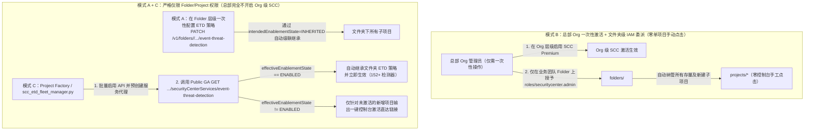

# SCC 与事件威胁检测 (ETD) 技术验证报告与自动化解决方案指南

本文档记录针对 Security Command Center (SCC) 与 Event Threat Detection (ETD) 三个核心工程与运维问题的实测验证结果、API 架构分析以及可直接交付外部客户投入生产的自动化解决方案。

---

## 📋 问题与验证结论汇总表

| # | 类别 | 核心问题摘要 | 状态 | 已验证外部可用解决方案 |
| :--- | :--- | :--- | :--- | :--- |
| **Q1** | **Premium 层级激活** | 项目级（Project-level）SCC Premium 激活是否仅支持控制台（Console-only）？是否有可用或规划中的编程接口（`gcloud` / API / Terraform）？ | `VERIFIED & RESOLVED` | **初次计费层级切换目前仅限控制台**；但**前置 API/服务身份预配**与**生效状态巡检 API**（`GET /v1/{parent}/locations/global/securityCenterServices/event-threat-detection`）已 **100% Public GA**（见 `scripts/scc_etd_fleet_manager.py`）。编程化激活 API 已在产品路线图中。 |
| **Q2** | **ETD 启用 (Terraform)** | 启用内置 ETD 服务及内置模块时，目前是否推荐在 Terraform 中封装 `gcloud scc manage services update event-threat-detection`，还是路线图中有原生 Terraform 资源计划？ | `VERIFIED & RESOLVED` | `SecurityCenterService` 原生 TF 资源已在 Provider 需求池跟踪中（`<= v8.5.0` 仅支持自定义模块）。**当前最佳实践**：使用可复用 Terraform 模块（`terraform/modules/scc-etd-service`），调用 **Public GA 的 Security Center Management API v1**（`PATCH .../securityCenterServices/event-threat-detection`）或带 `--quiet` 的 `gcloud`。 |
| **Q3** | **大规模单项目激活** | 在仅具备文件夹/项目级权限（无组织级 Organization 权限）的场景下，客户如何实现大规模车队级（Fleet scale）的项目级 SCC Premium 自动化激活？ | `VERIFIED & RESOLVED` | **三层车队级架构模式**：(1) **文件夹级（Folder-level）ETD 策略自动继承**（`folders/<FOLDER_ID>/.../event-threat-detection`），(2) **组织一次性激活 + 文件夹级 IAM 权限委派**（仅在 Folder 授予 `roles/securitycenter.admin`），(3) **自动化 Project Factory 预配置 + 全量巡检 + 增量一键激活直达链接 CLI**（`scripts/scc_etd_fleet_manager.py`）。 |

---

## 🔬 问题 1：项目级 SCC Premium 激活（Tier Flip）

> **原问题 (EN)**: Is activating project-level SCC Premium Console-only? We couldn't find any `gcloud` / API / Terraform way to do the tier flip. Is a programmatic path available or planned?

### 1.1 核心结论与底层架构原因
**是的 —— 目前将单项目（Project-level）SCC 从 Standard 切换为 Premium（或 Enterprise）层级的首次激活写操作仅限通过 Google Cloud Console 界面完成。**

当管理员在 Google Cloud Console 中为单项目点击 **Activate（激活）** 时，控制台在后台依次执行以下三步：
1. **创建专属服务代理（Service Agent）**：初始化项目级安全服务账号（`service-project-<PROJECT_NUMBER>@security-center-api.iam.gserviceaccount.com` 与 `service-project-<PROJECT_NUMBER>@gcp-sa-ktd-hpsa.iam.gserviceaccount.com`）。
2. **绑定项目级 IAM 角色**：在项目上绑定 `roles/securitycenter.serviceAgent` 与 `roles/containerthreatdetection.serviceAgent`。
3. **商业计费层级激活（Tier Flip）**：在完成交互式商业计费条款确认后，调用内部激活接口完成层级切换。由于该计费变更写接口目前仅对 Google Cloud Console 前端开放，从外部直接通过 REST 或 CLI 调用会返回 HTTP `404 Not Found`（`Method not visible to labels: {PUBLIC}`）。

### 1.2 当前已 100% Public GA 的编程能力与产品路线图
* **产品路线图（Roadmap）**：`securitycentermanagement.googleapis.com` 已在产品路线图中推进异步激活 API，未来将支持通过编程方式直接完成项目级激活。
* **当前外部客户可直接使用的 Public GA 能力**：
  1. **通过 CLI / Terraform 自动化启用前置 API 与预创建服务代理身份**：
     ```bash
     gcloud services enable securitycenter.googleapis.com securitycentermanagement.googleapis.com --project=<PROJECT_ID>
     gcloud beta services identity create --service=securitycenter.googleapis.com --project=<PROJECT_ID>
     ```
  2. **通过官方 Public GA 接口巡检项目 Premium 激活与 ETD 生效状态（`SecurityCenterService`）**：
     根据官方公开的 [Security Center Management API v1 规范](https://cloud.google.com/security-command-center/docs/reference/security-center-management/rest/v1/projects.locations.securityCenterServices)，`securityCenterServices/event-threat-detection` 返回的 `effectiveEnablementState` 字段同时反映父级继承策略以及**当前项目的计费层级资格（Billing Eligibility）与激活状态**。因为 ETD 是仅限 Premium/Enterprise 层级的高级服务：
     - 当 `intendedEnablementState` 为 `ENABLED` 或 `INHERITED`，但 `effectiveEnablementState` 为 `"DISABLED"` 时，代表该项目尚未激活 SCC Premium；
     - 当 `effectiveEnablementState` 为 `"ENABLED"` 时，即权威证明该项目已具备 SCC Premium/Enterprise 资格且 ETD 已处于运行状态。

---

## 🛠️ 问题 2：在 Terraform 中启用内置 ETD 服务与内置检测模块

> **原问题 (EN)**: The Terraform `google` provider (checked up to `v8.5.0`) only has resources for ETD custom modules. There's nothing for enabling the built-in ETD service or modules. Is wrapping `gcloud scc manage services update event-threat-detection` (Security Center Management API) in Terraform the recommended approach for now, or is a native TF resource on the roadmap?

### 2.1 核心结论与路线图状态
* **Terraform Provider 路线图**：针对 `SecurityCenterService`（`google_scc_management_organization_security_center_service` / `folder` / `project`）的原生 Terraform 资源已在 `hashicorp/terraform-provider-google` 需求池中立项跟踪，截至 `v8.5.0` 尚未发布。
* **底层 API 状态**：与问题 1 的计费层级切换不同，**Security Center Management API v1（`securityCenterServices/event-threat-detection`）的读取（`GET`）和修改（`PATCH`）均已 100% Public GA**，且原生支持 **Organization（组织）、Folder（文件夹）和 Project（项目）** 三个层级。
* **当前推荐的 Terraform 实践**：在原生资源发布前，官方推荐通过可复用 Terraform 模块封装 Security Center Management API v1（或带 `--quiet` 的 `gcloud scc manage services update event-threat-detection`），并配合 `data "http"` 实现实时状态回读与漂移检测。

### 2.2 实测发现的关键工程注意事项（Gotchas）
1. **`gcloud` 默认交互式确认会导致 Terraform 挂起**：
   直接运行 `gcloud scc manage services update event-threat-detection` 而不加 `--quiet` 时，CLI 会弹出交互式确认提示：
   ```text
   Are you sure you want to update the Security Center Service
   [projects/<PROJECT_ID>/locations/global/securityCenterServices/event-threat-detection]?
   Do you want to continue (Y/n)?
   ```
   **在 Terraform `local-exec` 或 CI/CD 流水线中，若漏掉 `--quiet` 参数会导致 `terraform apply` 永久挂起。** 务必始终传入 `--quiet`（或直接采用 REST `PATCH` 模式）。
2. **局部模块覆盖的无损合并机制（Server-Side Merge）**：
   通过 `--module-config-file` 或 `PATCH ...?updateMask=intendedEnablementState,modules` 仅传入需要覆盖的少数内置模块（如 `PERSISTENCE_IAM_ANOMALOUS_GRANT`）时，服务端会自动执行**增量合并**，完整保留其余约 170 个内置 ETD 检测器模块的既有状态。
3. **支持无损预检校验（`?validateOnly=true` / `--validate-only`）**：
   REST `PATCH` 接口与 `gcloud` CLI 均原生支持无损 Dry-Run 预检校验。

### 2.3 真实项目实测验证日志（已脱敏）
```text
$ python3 scripts/scc_etd_fleet_manager.py configure-etd \
    --scope projects/<PROJECT_ID> \
    --state ENABLED \
    --enable-modules PERSISTENCE_IAM_ANOMALOUS_GRANT,MALWARE_BAD_DOMAIN

[
  {
    "parent": "projects/<PROJECT_ID>",
    "validateOnly": false,
    "name": "projects/<PROJECT_NUMBER>/locations/global/securityCenterServices/event-threat-detection",
    "intendedEnablementState": "ENABLED",
    "effectiveEnablementState": "ENABLED",
    "updatedModules": {
      "PERSISTENCE_IAM_ANOMALOUS_GRANT": {
        "intendedEnablementState": "ENABLED",
        "effectiveEnablementState": "ENABLED"
      },
      "MALWARE_BAD_DOMAIN": {
        "intendedEnablementState": "ENABLED",
        "effectiveEnablementState": "ENABLED"
      }
    }
  }
]
```

完整可复用 Terraform 模块实现请参见 [`terraform/modules/scc-etd-service`](../terraform/modules/scc-etd-service/README_CHN.md)。

---

## 🌐 问题 3：无组织级（Org）权限下的车队级（Fleet-Scale）单项目激活方案

> **原问题 (EN)**: Our access is at folder / project level (no org-level ownership), so project-by-project activation is our only option. If Premium activation is Console-only, that means clicking through every project by hand, now and for every new project. How do other customers in the same setup handle this at fleet scale? Is there any supported automation path (API, `gcloud`, TF) for project-level activation, even in preview or via allowlist?

### 3.1 同类企业客户在 Folder / Project 权限边界下的三种规模化落地方案



在没有组织级（Organization-level）IAM 所有权的企业环境中，客户通常采用以下三种架构模式：

#### 模式 A：在文件夹（Folder）层级一次性配置 ETD（彻底免除逐项目配置 ETD 模块）
即便 SCC Premium 需要在项目级激活，**Public GA 的 Security Center Management API（`securityCenterServices/event-threat-detection`）原生支持 `folders/<FOLDER_ID>` 作用域！**
* 默认情况下，每个新建 GCP 项目的 `event-threat-detection` 状态均为 `intendedEnablementState: INHERITED`（继承父节点）。
* 只要您的团队在 `folders/<FOLDER_ID>` 上拥有 `roles/securitycenter.settingsEditor`（或 `roles/securitycentermanagement.securityCenterServicesEditor`）权限，只需在 **Folder 层级一次性配置 ETD 启用状态及内置检测器模块策略**：
  ```bash
  python3 scripts/scc_etd_fleet_manager.py configure-etd \
    --scope folders/<FOLDER_ID> \
    --state ENABLED \
    --enable-modules PERSISTENCE_IAM_ANOMALOUS_GRANT,MALWARE_BAD_DOMAIN,CRYPTOMINING_POOL_DOMAIN
  ```
* 该文件夹下的所有存量与新建子项目一旦激活 SCC Premium，将**自动继承**文件夹的 ETD 配置并生效（`effectiveEnablementState: ENABLED`），无需逐项目调用 API 配置模块。

#### 模式 B：总部一次性 Org 级激活 + 文件夹级 IAM 权限委派（企业彻底消除单项目点击的标准范式）
许多大型企业的二级部门/业务线团队误以为“使用 Org 级自动激活就必须给业务团队授予 Organization 级 IAM 权限”。**实际上完全不需要。**
* Google Cloud SCC 原生支持**基于文件夹（Folder-scoped）的分权管理**：只需由总部云平台管理员执行**一次性**的 Org 级 SCC 激活，然后将 `roles/securitycenter.admin`（或 `roles/securitycenter.settingsEditor` + `roles/securitycenter.findingsEditor`）**仅绑定在您团队所属的 `folders/<FOLDER_ID>` 上**：
  1. 您的 Project Factory 在 `folders/<FOLDER_ID>` 下创建的所有存量及未来新建项目，**100% 自动激活 SCC Premium 与 ETD，彻底实现零控制台手工点击**。
  2. 您的团队仅能查看和管理 `folders/<FOLDER_ID>` 范围内的安全发现项（Findings）、ETD 内置模块和自定义模块，无需任何 Org 级权限。

#### 模式 C：Project Factory 前置自动化 + 车队级增量巡检 CLI（当总部完全无法开启 Org 级 SCC 时）
如果总部明确拒绝开启 Org 级 SCC、强制要求各项目独立开启 Project-level 计费：
1. **在 Terraform / Project Factory 中自动化完成前置工作（`prepare`）**：
   在项目创建流水线中调用 [`scripts/scc_etd_fleet_manager.py prepare`](../scripts/scc_etd_fleet_manager.py) 或 [`terraform/examples/project-and-folder-etd`](../terraform/examples/project-and-folder-etd/main.tf)，为文件夹下的所有项目自动启用 `securitycentermanagement.googleapis.com` 和 `securitycenter.googleapis.com`。
2. **基于官方 Public GA 接口的车队级状态巡检（`audit`）**：
   在 CI/CD 中运行 `scc_etd_fleet_manager.py audit --folder <FOLDER_ID> --expand-folder-projects`，自动扫描文件夹下的所有活跃项目，校验实时 `effectiveEnablementState`，并**仅针对尚未完成层级切换的新建项目**生成一键控制台激活直达链接（`https://console.cloud.google.com/security/command-center/onboarding?project=<PROJECT_ID>`）：

```text
$ python3 scripts/scc_etd_fleet_manager.py audit --projects <PROJECT_ID>

RESOURCE                               TIER_ELIGIBILITY             ETD_INTENDED   ETD_EFFECTIVE  MODULES(EN/DIS) 
------------------------------------------------------------------------------------------------------------------
projects/<PROJECT_ID>                  PREMIUM_OR_ENTERPRISE        INHERITED      ENABLED        152/19          
```
